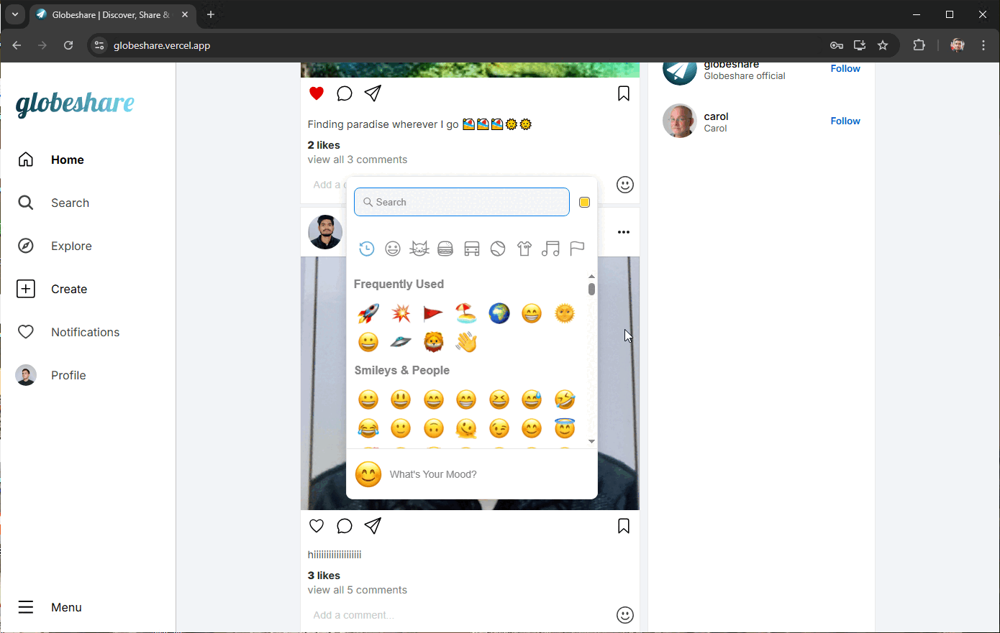

# 🌍 GlobeShare - A Social Media Platform

GlobeShare is a modern social media web application built with React and Firebase. It enables users to share their thoughts, connect with others, and engage with content seamlessly.

## 🌐 Live Demo

🔗 **[Link](https://globeshare.vercel.app/)** 

## 🚀 Features

- 🔥 User Authentication (Signup, Login, Logout)
- 📝 Create, Edit, and Delete Posts
- ❤️ Like and Comment on Posts
- 👤 User Profiles and Follow System
- 📸 Upload and Share Images
<!-- - 🔔 Real-time Notifications
- 🌙 Light/Dark Mode -->

## 🛠️ Tech Stack

- **Frontend**: React
- **Backend**: Firebase (Firestore, Authentication, Storage)

