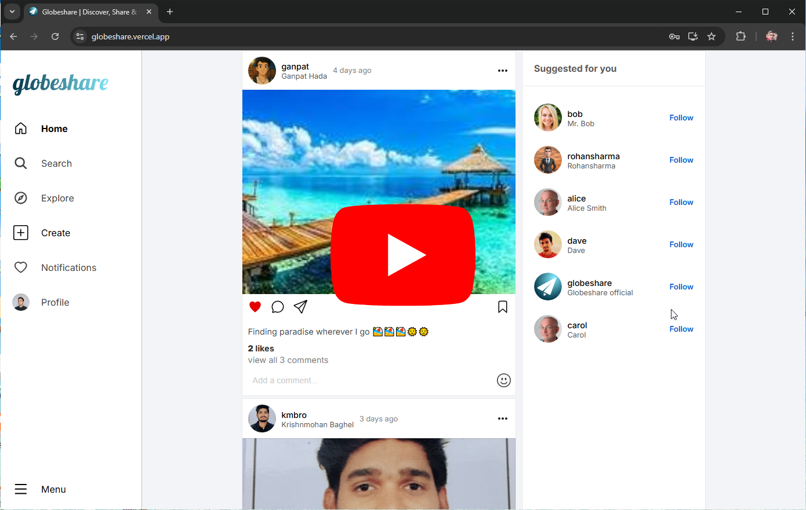

# 🌍 GlobeShare – A Social Media Platform

**GlobeShare** is a modern social media web application built with **React** and **Firebase**.  
It enables users to share their thoughts, connect with others, and engage with content seamlessly.

---

## 🌐 Live Demo

🔗 **Live App:** https://globeshare.vercel.app

---

## 🎥 Video Demo

---

## 🚀 Features

- 🔥 **User Authentication:** Signup, Login, and Logout  
- 📝 **Post Management:** Create, Edit, Bookmark, and Delete Posts  
- ❤️ **Engagement:** Like, Comment, and Share Posts  
- 👤 **Profiles:** View user profiles and follow other users  
- 📸 **Media Sharing:** Upload and share images or thoughts  
- 📄 **Custom Feed:** Sort posts by date or trending  

---

## 🛠️ Tech Stack

- **Frontend:** React.js  
- **Backend:** Firebase (Firestore, Authentication, Storage)

---

⭐ If you like this project, don’t forget to **star the repo** and share it!  
